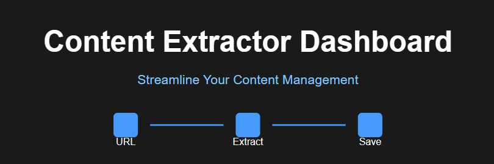
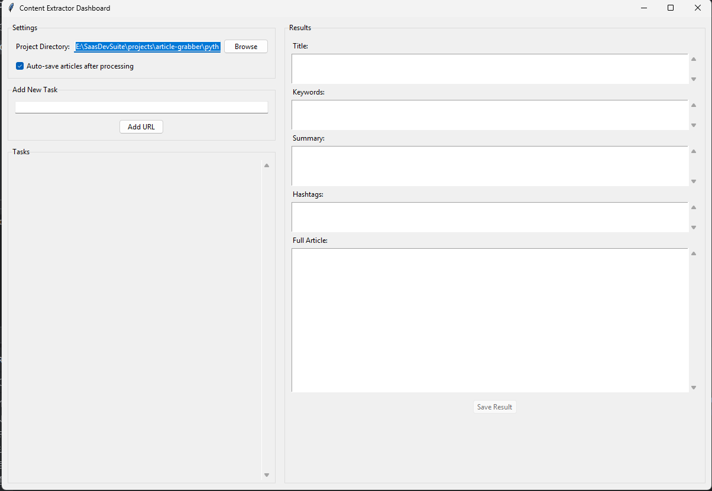
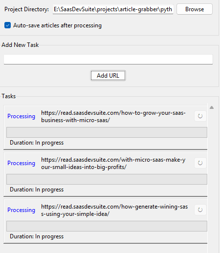
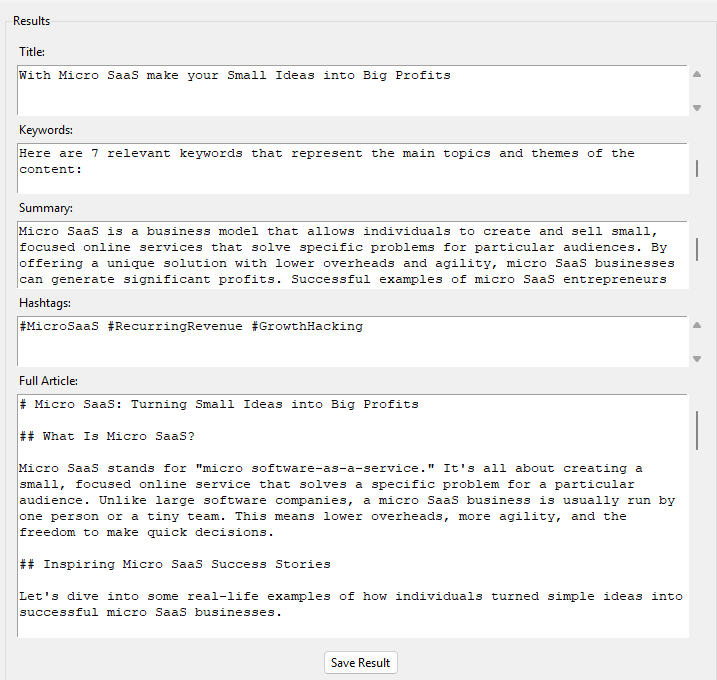

<div align="center">
  

# Content Extractor

📰 A powerful desktop application for extracting and analyzing content from web URLs

[](https://www.python.org/downloads/)
[](https://opensource.org/licenses/MIT)
[](https://ollama.ai)
 
</div>

<div align="center"> 
  <a href="https://www.buymeacoffee.com/ceylon">
    
  </a>
</div>

## Introduction

A powerful desktop application for extracting and analyzing content from web URLs. Built with Python and Tkinter, this
tool provides a user-friendly interface for processing multiple URLs simultaneously, extracting key information, and
saving results locally.


## Buy Me A Coffee

If you find this tool useful, you can consider supporting its development by buying me a coffee. This will help me
continue to improve and maintain the tool. Your support is greatly appreciated!


## ✨ Features

- 🔗 **URL Processing**: Process multiple URLs simultaneously with a queue-based system
- 🤖 **Content Analysis**: Extract titles, keywords, summaries, and generate relevant hashtags
- 📊 **Progress Tracking**: Real-time status updates and progress monitoring for each task
- 💾 **Auto-save**: Automatically save processed content to local files
- ⚙️ **Task Management**: Pause, restart, or review completed tasks
- 🎛️ **Configurable Settings**: Customize save directory and auto-save preferences

## Screenshots

<div align="center">
  
  
   
</div>

## Prerequisites

- Python 3.7 or higher
- tkinter (usually comes with Python)
- Ollama for running the LLaMA model

## Installing Ollama

1. Install Ollama based on your operating system:

### Linux

```bash
curl https://ollama.ai/install.sh | sh
```

### macOS

```bash
brew install ollama
```

### Windows

Download and run the installer from [Ollama's official website](https://ollama.ai/download)

2. Start the Ollama service:

```bash
ollama serve
```

3. Pull the LLaMA model:

```bash
ollama pull llama2
```

4. Verify the installation:

```bash
ollama list
```

You should see `llama2` in the list of available models.

5. Configure the application to use Ollama:
    - The application is pre-configured to use "llama3.2" as the model name
    - Update the model name in `ContentExtractor` initialization if using a different model version

## Installation

1. Clone the repository:

```bash
git clone <repository-url>
cd content-extractor
```

2. Install required dependencies:

```bash
pip install -r requirements.txt
```

3. Ensure Ollama is running:
    - Start Ollama service if not already running
    - Verify the LLaMA model is available

## Usage

1. Start the application:

```bash
python content_extractor_gui.py
```

2. Configure Settings:
    - Click "Browse" to set your preferred project directory
    - Toggle auto-save option as needed

3. Process URLs:
    - Enter a URL in the input field
    - Click "Add URL" to start processing
    - Monitor progress in the tasks list
    - View results by clicking on completed tasks

4. Managing Tasks:
    - Click on any task to view its details
    - Use the restart button (↻) to reprocess failed or completed tasks
    - Save results manually using the "Save Result" button if auto-save is disabled

## Task States

- **Queued**: Task is waiting to be processed
- **Processing**: Currently extracting content
- **Completed**: Successfully processed
- **Error**: Failed to process (can be restarted)

## Output Format

Results are saved as JSON files with the following structure:

```json
{
  "title": "Article Title",
  "keywords": [
    "keyword1",
    "keyword2",
    ...
  ],
  "content_summary": "Brief summary of the content",
  "hashtags": [
    "#hashtag1",
    "#hashtag2",
    ...
  ],
  "full_article": "Complete article text"
}
```

## Configuration

The application stores its configuration in `content_extractor_config.json`:

```json
{
  "project_dir": "/path/to/save/directory",
  "auto_save": true
}
```

## Technical Details

### Key Components

1. **URLTask**: Manages individual URL processing tasks
    - Tracks status, progress, and results
    - Handles timing and error states

2. **TaskPanel**: UI component for displaying task information
    - Real-time status updates
    - Progress bar
    - Duration tracking
    - Save path display

3. **ContentExtractorGUI**: Main application interface
    - Manages task queue and threading
    - Handles file I/O and configuration
    - Provides user interface controls

### Threading Model

- Uses a queue-based system for task management
- Processes multiple URLs concurrently
- Maintains UI responsiveness with proper thread management
- Limits concurrent processing to prevent resource exhaustion

## Error Handling

The application includes comprehensive error handling for:

- Invalid URLs
- Network issues
- Processing failures
- File system operations
- Configuration management

## Contributing

Contributions are welcome! Please follow these steps:

1. Fork the repository
2. Create a feature branch
3. Commit your changes
4. Push to the branch
5. Create a Pull Request

## License

MIT

## Support

For issues and feature requests, please:

1. Check existing issues in the repository
2. Create a new issue with detailed information
3. Include steps to reproduce any bugs

## Acknowledgments

- Built using Python and Tkinter
- Uses LLaMA model for content analysis through Ollama